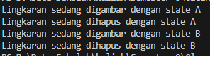

# State Design Pattern untuk Bangun Datar

Project ini merupakan contoh implementasi State Design Pattern pada domain kasus bangun datar. State Design Pattern digunakan untuk mengelola perubahan state pada suatu objek, sehingga objek tersebut dapat berperilaku berbeda tergantung pada state yang sedang aktif.

Pada project ini, terdapat dua state yang berbeda: StateA dan StateB. Kedua state ini mengimplementasikan interface State yang memiliki dua method: draw() dan erase().

Kelas Lingkaran digunakan untuk mengelola state yang sedang aktif. Ketika state diganti dari State A ke State B atau sebaliknya, perilaku objek akan berubah sesuai dengan state yang baru.

Berikut ini adalah contoh output program: 

